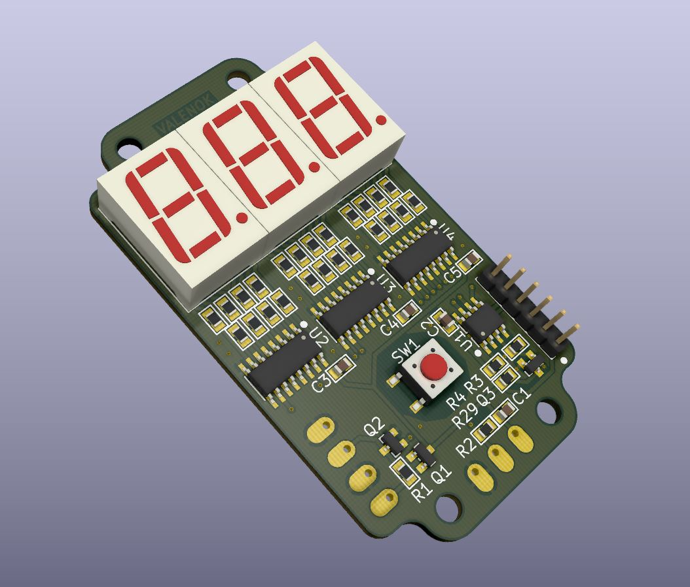
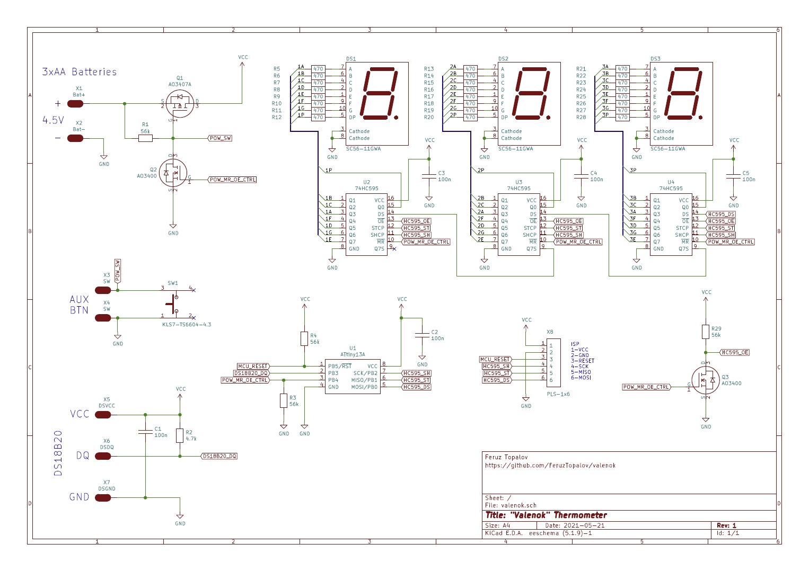
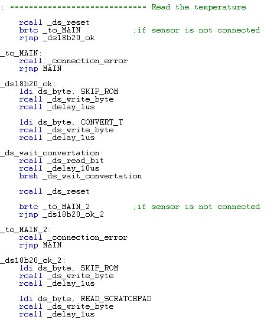
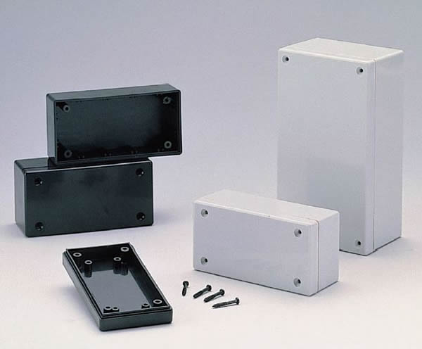
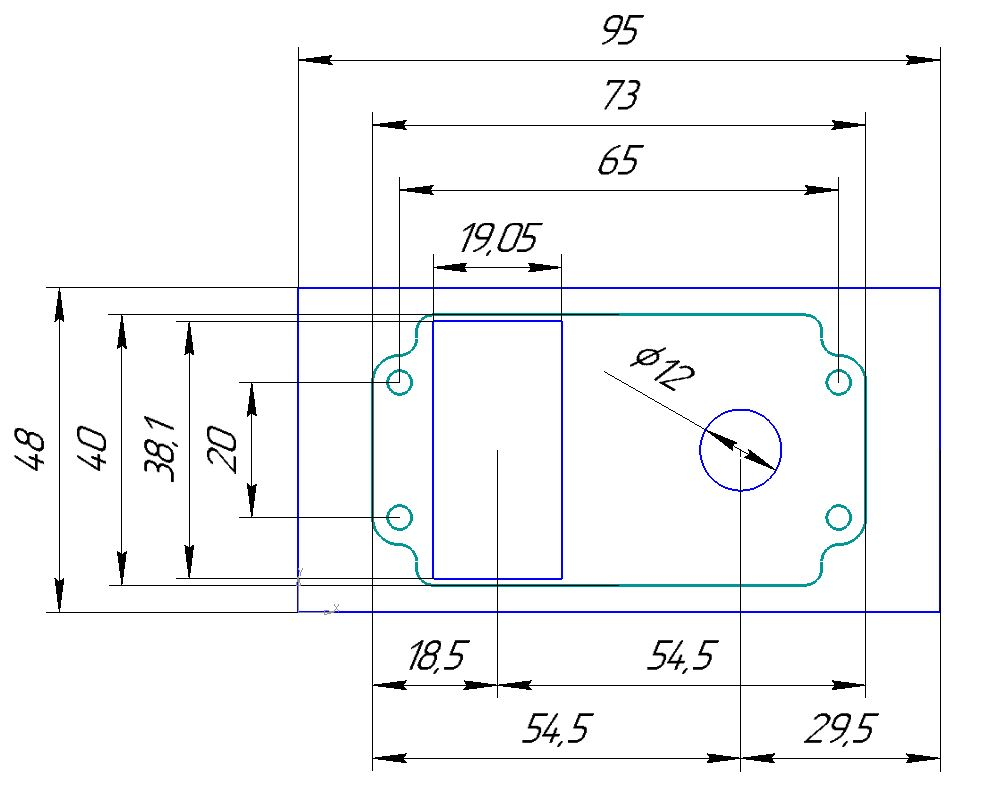

## **VALENOK** - yet another DS18B20 thermometer, but...

  <a href="https://youtu.be/WqwGhjjpDnw">--> Watch it on youtube now! <--</a>

* Eyes-friendly static indication
* Zero-consumption when IDLE, years without battery replacement
* Single button interface
* Only temperature - who the f**k needs more?
* Totally open-source/open-hardware
* Easy solderable - 0805 chip components and huuuge SMD packages

  

## Hardware

Well, it is a typical KiCad project, schematic + PCB. Also there are prepared gerbers, so if you don't want to deal with KiCad, just zip "gerbers" folder and send it to your PCB supplier. 

Schematic is pretty simple. Q1 and Q2 are power switch, which is controlled via MCU. Q3 is a "HC595 anti-glitch" which controls the sift registers state at power-up. By the way, switch SW1 powers on the thermometer, after that MCU holds Q2's gate until the end of the program.

As you can see, power switch and shift registers are controlled using common pin PB4 (POW_MR_OE_CTRL). That trick is here in order to clear the shift registers (HC595) at startup. The algorithm is following:

* User pushes the SW1
* PB4 is low, power is not engaged by Q2
* OE is high due to inversion at the Q3, outputs of the shift registers are in Hi-Z
* MR is low, shift registers are cleared
* Firmware strikes a strobe to the shift registers ST inputs, the content of the shift registers (which are empty) are copied to the outputs
* Finally, MCU rise up PB4, engage the power switch and enables the shift registers outputs
* You see empty 7-seg display, no randomly blinking segments anymore... PROFIT!

_See 'Pictures/Trick.jpg' for details_

## Firmware

Written in assembler using pretty old AVR Studio 4.19, therefore i publish only the listing but not the project file. I you want to compile by yourself, use any appropriate AVR compiler or find AVR Studio 4.19 on the internet. Anyway there is a ready .hex file to flash.

Firmware flow:
* Clear HC595 registers
* Hold the power
* Blink all segments for 100 ms in order to check their functionality
* Check sensor presence, show "---" if not connected
* Read the temperature
* Calculate CRC, show "crc" if mismatch
* Check DS18B20 for 12-bit mode, if not then switch to 12-bit mode
* Perform temperature rounding +-0.5 Celsius degree
* Prepare display content and show
* Hold on for 3 sec
* Release the power

Flashing is also simple, the only thing you should aware is that you have to change fuse bits. Tiny13A's factory default fuses are LOW:0x6A; HIGH:0xFF. To make thermometer works it is only needed to switch off internal clock division by 8 (CKDIV8). Therefore only LOW fuse is affected, it's value changes from LOW:0x6A to LOW:0x7A - that simple. I recommend to use AVRDUDESS (https://github.com/zkemble/AVRDUDESS). 

## Enclosure

It is designed to be placed in a market available GAINTA G1068G/G1068B enclosure. It has dimensions of 95 x 48 x 38 mm. 

PCB is fixed to the smaller lid using 20 mm Male-Female Hex standoffs; 3x AA batteries with no holder are placed underneath the PCB.

In "dxf" folder you can find a guide where to make holes - one for 7-Seg display, one for button:

